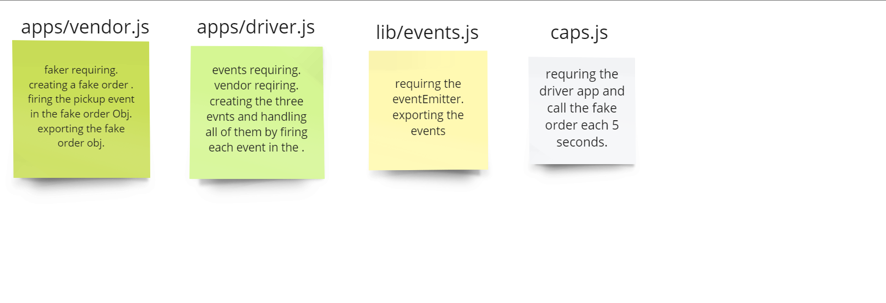

# CAPS-
event driven repo.

# summary :
for today's task we had to create three events
* The first to tell the the driver to pick an order up
* The second so the driver tell that the order is being deliverd.
* The last one so the driver confirms that the orded is delivered.

# UML :

